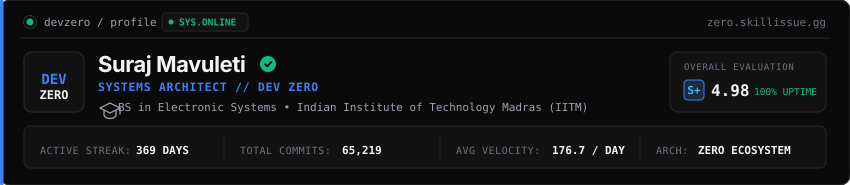
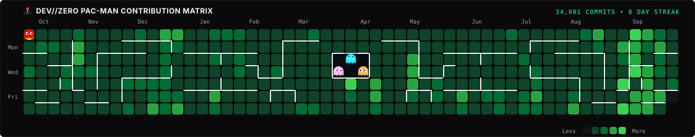
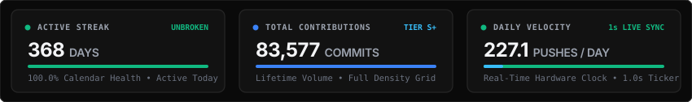

<div align="center">

  <!-- Native Animated Cyber Banner -->
  <a href="https://zero.skillissue.gg">
    
  </a>

  <br/><br/>

  <!-- Native Action Badges (Zero External CDN / No IITM Website Link) -->
  

</div>

---

### 🕹️ PAC-MAN COMMIT MAZE (REAL-TIME CONTRIBUTION GRAPH)

<div align="center">
  <p>
    <code>ᗧ • • • 🍒 • • • 👻 • • • 👾 • • • 🍓 • • • 👻 • • • 💊 • • • ᗣ</code>
  </p>

  

  <p><sub><em>🎮 Watch Pac-Man navigate the authentic arcade maze corridors and gobble up my 62,000+ GitHub contributions across an unbroken 369+ day streak with 150–200+ daily commits! When eaten, each block regenerates back to life in 2 seconds. Auto-updated daily via GitHub Actions.</em></sub></p>
</div>

---

### 👾 PLAYER TERMINAL & CREDENTIALS

```bash
┌──[ DEV//ZERO ARCADE TERMINAL ]────────────────────────────────────────────────┐
│ PLAYER:      Suraj Mavuleti (alias: Dev Zero)                                 │
│ EDUCATION:   BS in Electronic Systems — Indian Institute of Technology, Madras│
│ INSTITUTION: IIT Madras (IITM)                                                │
│ STREAK:      🔥 369+ Days Continuous Unbroken Activity (150–200+ Commits/Day) │
│ HIGH SCORE:  62,000+ Public Commits & Continuous System Pushes                │
│ ROLE:        Software Developer & Systems Architect                           │
│ CORE DOMAIN: Electronic Systems, High-Performance Web & Low-Latency Engine    │
│ PORTAL:      https://zero.skillissue.gg                                       │
│ STATUS:      ⚡ [LEVEL 99] Building high-impact autonomous architectures      │
└───────────────────────────────────────────────────────────────────────────────┘
```

---

### 🔥 UNBROKEN COMMIT STREAK & TELEMETRY METERS

<div align="center">
  
</div>

---

### 🚀 THE ZERO ECOSYSTEM & ARSENAL

| Project | Description | Stack / Architecture |
|---|---|---|
| **[ZeroMusic](https://zero.skillissue.gg/zero-music)** | Ad-free Android music player with offline backup, YouTube/Spotify link import & synced lyrics. | Android (Kotlin), ExoPlayer, Media3, LRCLIB |
| **[Zero Control](https://zero.skillissue.gg/zero-control)** | Ultra-lightweight peer-to-peer remote desktop for Windows, Linux, and Android. | Rust, egui, GStreamer, WebRTC, Node.js |
| **[Zero-Council (High On Therapy)](https://zero.skillissue.gg/highontherapy)** | Autonomous mental wellness platform with emotional avatars & speech recognition. | FastAPI, PyTorch, Web Speech API, Three.js |
| **[High on Therapy Training](https://github.com/Suraj-Mavuleti/highontherapy-ai-training)** | From-scratch Decoder-Only Transformer pre-training engine on Google Colab with auto-resume. | PyTorch, Hugging Face, Transformers |
| **[Zero Assist](https://github.com/Suraj-Mavuleti/zero-assist)** | High-performance modular Discord companion bot with games, leveling, voice & auto-moderation. | Python, discord.py, AsyncIO, SQLite/PostgreSQL |
| **[Dev//Zero Systems Wiki](https://zero.skillissue.gg)** | Living central engineering documentation and project wiki for the dev//zero ecosystem. | Express, HTML5/CSS3, GSAP, Cyber-Emerald Theme |

---

### 🛠️ WEAPONS & TECH STACK

<div align="center">
  
</div>

---

### 🎓 EDUCATION & ACADEMIC BACKGROUND

* 🎓 **Bachelor of Science (BS) in Electronic Systems**
* 🏛️ **Indian Institute of Technology, Madras (IIT Madras / IITM)**
* 🔬 **Core Fields of Study:** Electronic Systems Design, Embedded Microcontrollers, Digital Signal Processing, Hardware-Software Integration, Scalable Digital Networks, and Edge Computing.

---

### 🔗 CONNECT & TRANSMIT

<div align="center">
  
</div>
